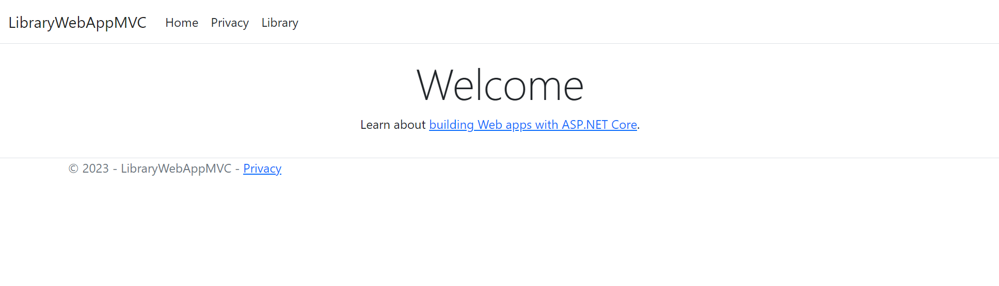
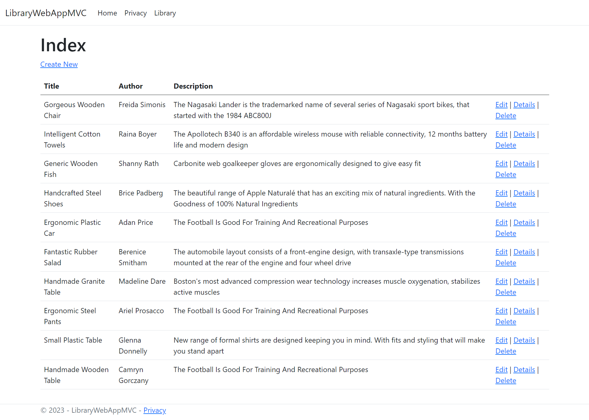
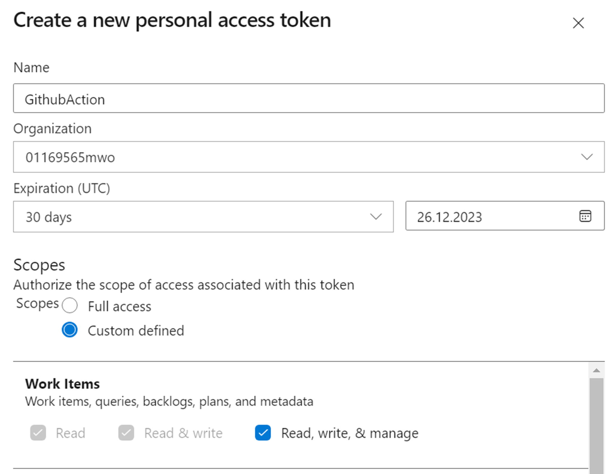
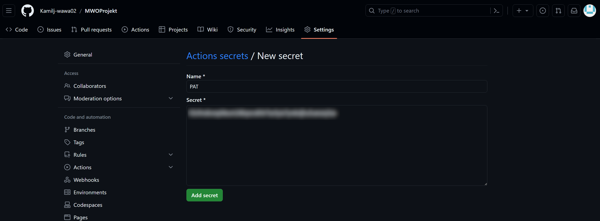
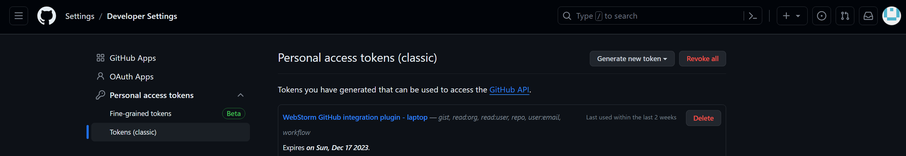
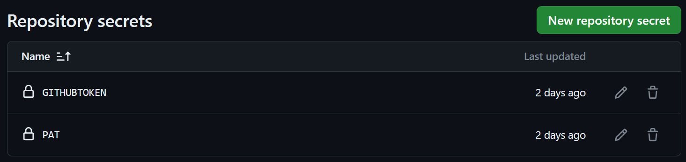
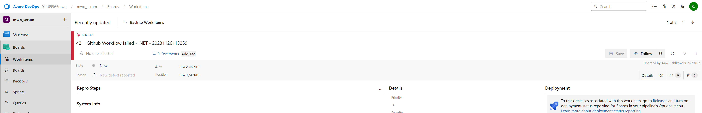

# Projekt na metodyki wytwarzania oprogramowania 

Celem projektu było utworzenie i konfiguracja pipeline'a **continuous integration** z wykorzystaniem **Github Actions** oraz integracja z **Azure DevOps** wykorzystując do tego REST API.

Napisany przeze mnie skrypt testuje poprawność wykonanych testów UI w **Selenium** dla mojej aplikacji webowej napisanej w **C#** i implementującej wzorzec **MVC**. W przypadku niepowodzenia procesu testowania, zostaje zgłaszany nowy workitem (Bug) w Azure DevOps.

## Aplikacja

Projekt został napisany w **.NET 7.0**, wykorzystano w nim wzorzec MVC (Model, View, Controller). Zostały zaimplementowane podstawowe metody CRUD: tworzenie, odczyt, edycja i usuwanie.
Aplikacja składa się na: stronę główną, domyślną stronę dot. prywatności, listę książek, formularz dodawania, edycji, usuwania i szczegółów książki. Zawartość bazy danych została wygenerowana z wykorzystaniem biblioteki **Bogus**.




## Testy Selenium

Testy zostały napisane z wykorzystaniem **MSTest** i są przeprowadzane przy pomocy **FirefoxDriver** z następującą konfiguracją:
- argument **--marionette-port=0** - nasłuchiwany port zostaje automatycznie wybrany przez oprogramowanie
- argument **--headless** - przeglądarka zostanie uruchomiona w trybie bez użycia interfejsu użytkownika - argument jest niezbędny do uruchomienia testów w Github Actions i zostaje dodany do parametrów startowych jedynie w tym środowisku, w przypadku standardowego uruchomienia na komputerze, zostanie przedstawiony interfejs użytkownika
- ustawiono **AcceptInsecureCertificates** na wartość **true**, co pozwali uniknąć problemów z certyfikatami w uruchomionym środowisku.

Nazwy testów zaczynają się od T0X, aby ustawić kolejność ich wykonywania w przypadku używanego środowiska.

```csharp
using OpenQA.Selenium;
using OpenQA.Selenium.Firefox;


namespace LibraryWebAppMVC.Tests
{
    [TestClass]
    public class WebAppTests
    {
        private IWebDriver Driver;
        private static string APP_URL = "https://localhost:7255/LibraryAPI";

        [TestInitialize]
        public void Initialize()
        {
            FirefoxOptions options = new FirefoxOptions();
            options.AddArgument("--marionette-port=0");
            if (IsRunningInGithubActions())
            {
                options.AddArgument("--headless");
            }
            options.AcceptInsecureCertificates = true;
            Console.WriteLine("Setup Firefox Driver...");
            Driver = new FirefoxDriver(options);            
        }

        private bool IsRunningInGithubActions()
        {
            string githubActions = Environment.GetEnvironmentVariable("GITHUB_ACTIONS");
            if (!string.IsNullOrEmpty(githubActions) && githubActions.Equals("true", StringComparison.OrdinalIgnoreCase))
            {
                return true;
            }
            return false;
        }

        [TestCleanup]
        public void Cleanup()
        {
            Driver.Quit();
        }

        [TestMethod]
        public void T01_CreateTest()
        {
            Driver.Navigate().GoToUrl(APP_URL + "/Create");
            Thread.Sleep(2000);
            Console.WriteLine("Redirected to /create");
            Console.WriteLine("URL: ", Driver.Url.ToString());
            Console.WriteLine("Content: " + Driver.PageSource.ToString());
            Driver.FindElement(By.CssSelector("#Title")).SendKeys("TestTitle");
            Driver.FindElement(By.CssSelector("#Author")).SendKeys("TestAuthor");
            Driver.FindElement(By.CssSelector("#Description")).SendKeys("TestDescription");
            Driver.FindElement(By.CssSelector("input[value='Create']")).Click();
            Thread.Sleep(1000);
            IWebElement tableRecord = Driver.FindElement(By.XPath("//*[contains(text(),'" + "TestTitle" + "')]"));
            Assert.IsTrue(tableRecord.Displayed);
        }

        
        [TestMethod]
        public void T02_GetTest()
        {
            Driver.Navigate().GoToUrl(APP_URL);
            Thread.Sleep(1000);
            IWebElement bookToEdit = Driver.FindElement(By.XPath("//*[contains(text(),'" + "TestTitle" + "')]"));
            IWebElement bookToEditParent = bookToEdit.FindElement(By.XPath("./.."));
            bookToEditParent.FindElement(By.CssSelector("a[aria-label='details']")).Click();
            Thread.Sleep(1000);
            IWebElement detailsRecord = Driver.FindElement(By.XPath("//*[contains(text(),'" + "TestTitle" + "')]"));
            Assert.IsTrue(detailsRecord.Displayed);
        }

        [TestMethod]
        public void T03_UpdateTest()
        {
            Driver.Navigate().GoToUrl(APP_URL);
            Thread.Sleep(1000);
            IWebElement bookToEdit = Driver.FindElement(By.XPath("//*[contains(text(),'" + "TestTitle" + "')]"));
            IWebElement bookToEditParent = bookToEdit.FindElement(By.XPath("./.."));
            bookToEditParent.FindElement(By.CssSelector("a[aria-label='edit']")).Click();
            Thread.Sleep(1000);
            IWebElement elementToEdit = Driver.FindElement(By.CssSelector("#Title"));
            elementToEdit.Clear();
            elementToEdit.SendKeys("TestTitleUpdated");
            Driver.FindElement(By.CssSelector("input[value='Save']")).Click();
            Thread.Sleep(1000);
            IWebElement tableRecord = Driver.FindElement(By.XPath("//*[contains(text(),'" + "TestTitleUpdated" + "')]"));
            Assert.IsTrue(tableRecord.Displayed);
        }

        [TestMethod]
        public void T04_DeleteTest()
        {
            Driver.Navigate().GoToUrl(APP_URL);
            Thread.Sleep(1000);
            IWebElement bookToDelete = Driver.FindElement(By.XPath("//*[contains(text(),'" + "TestTitle" + "')]"));
            IWebElement bookToDeleteParent = bookToDelete.FindElement(By.XPath("./.."));
            bookToDeleteParent.FindElement(By.CssSelector("a[aria-label='delete']")).Click();
            Thread.Sleep(1000);
            Driver.FindElement(By.CssSelector("input[value='Delete']")).Click();
            Thread.Sleep(1000);
            Assert.ThrowsException<OpenQA.Selenium.NoSuchElementException>(() =>
                    Driver.FindElement(By.XPath("//*[contains(text(),'" + "TestTitle" + "')]")));
        }

    }
}
```

## Github Actions

Napisany workflow w Github Actions zostaje uruchomiony w przypadku wykonania operacji **pull request** lub **merge**. Zostaje uruchomione środowisko gotowe do uruchomienia testów aplikacji.

Przy tworzeniu poniższego workflow napotkałem na problemy z odmową dostępu w przypadku próby uruchomienia programu. Użyłem więc polecenia **chmod** aby nadać pełne uprawnienia w przypadku wszystkich podfolderów w katalogu głównym projektu. Następnie zostaje uruchomiony zbudowany wcześniej program z wykorzystaniem polecenia **nohup** (no hang up), dzięki któremu proces całego skryptu nie zostanie zatrzymany. Teraz zostają wykonane wszystkie testy. W przypadku niepowodzenia któregoś z testów, zostaje utworzony nowy workitem w Azure DevOps - bug ze znacznikiem czasu zdarzenia. Aby uzyskać tę funkcjonalność posłużyłem się skryptem dostępnym na Github Actions użytkownika stefanstranger.


```yaml
name: .NET

on:
  push:
    branches: [ "main" ]
  pull_request:
    branches: [ "main" ]

jobs:
  run-program-and-tests:

    runs-on: ubuntu-latest

    steps:
    - uses: actions/checkout@v3
    - name: Setup .NET
      uses: actions/setup-dotnet@v3
      with:
        dotnet-version: 7.0.x
    - name: Restore dependencies
      run: dotnet restore
    - name: Build
      run: dotnet build --configuration Release --no-restore
    - name: Set executable permissions
      run: |
        chmod 777 -R /home/runner/work/MWOProjekt/MWOProjekt

    - name: Run the program
      run: nohup dotnet /home/runner/work/MWOProjekt/MWOProjekt/LibraryWebAppMVC/bin/Release/net7.0/LibraryWebAppMVC.Client.dll &

    - name: Test
      run: dotnet test --verbosity normal

    - name: Create Bug Workitem on job failure
      uses: stefanstranger/azuredevops-bug-action@1.1
      if: failure()
      with:
        OrganizationName: "01169565mwo"
        PAT: "PAT"
        ProjectName: "mwo_scrum"
        AreaPath: "mwo_scrum"
        IterationPath: "mwo_scrum"
        GithubToken: "GithubToken"
        WorkflowFileName: "integration.yml"
      env:
        PAT: ${{ secrets.PAT }}
        GithubToken: ${{ secrets.githubtoken }}
```

## Konfiguracja integracji z Azure DevOps

Aby odpowiednio skonfigurować integrację z Azure DevOps musiałem uzyskać **PAT**, czyli Personal Access Token pozwalający nam na przeprowadzanie działań w projekcie Azure DevOps.



Następnie uzyskany token dodałem do sekretów mojego repozytorium.



Kolejnym krokiem było wygenerowanie tokenu Github, co pozwoli nam na dostęp do Github Actions i sprawdzania napotkanych błędów podczas wykonywania workflow.



Po dodaniu tokenu Github, w moim repozytorium znajdują się 2 sekrety zawierające tokeny wymagane do przeprowadzenia integracji Github Actions z Azure DevOps.



Przykładowy bug utworzony w DevOps został zaprezentowany poniżej.



## Działanie utworzonego workflow

Film z prezentacją wideo mojego projektu został dodany do repozytorium jako plik **showcase.mp4**.


